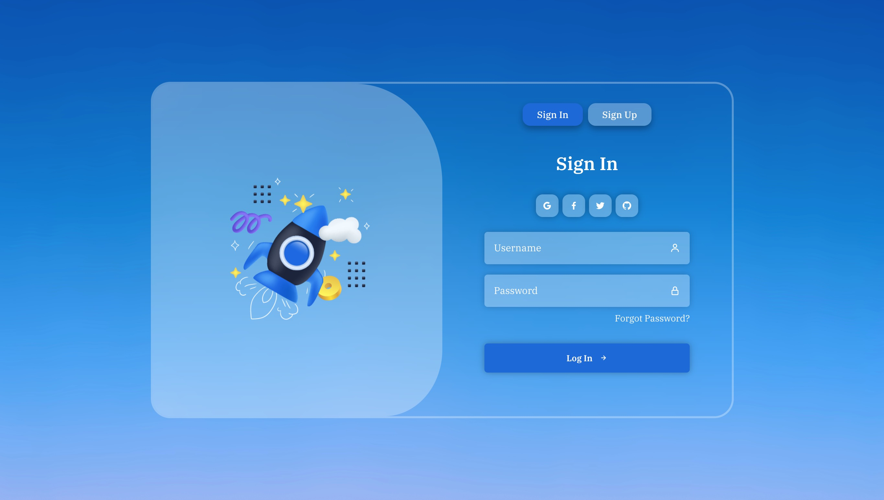

# React SignIn Form

This project showcases a SignIn form designed with React.


## Getting Started

This project was bootstrapped with [Create React App](https://github.com/facebook/create-react-app). 

Follow these instructions to get the project up and running locally.

### Prerequisites

Ensure you have the following installed:
- [Node.js](https://nodejs.org/) (v14 or higher)
- [npm](https://www.npmjs.com/) (comes with Node.js)

## Navigate to the Project Directory

```bash
cd front-end-projects/mini-projects(react)/SignIn-page

## Install Dependencies

```bash
npm install

## Start the server
```bash
npm start

Runs the app in the development mode.\
Open [http://localhost:3000](http://localhost:3000) to view it in your browser.

The page will reload when you make changes.\
You may also see any lint errors in the console.

## Here’s a preview of the UI:


